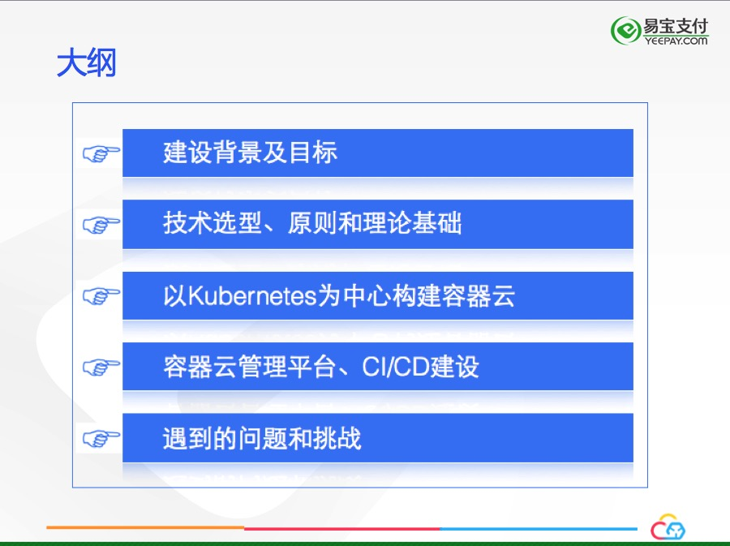
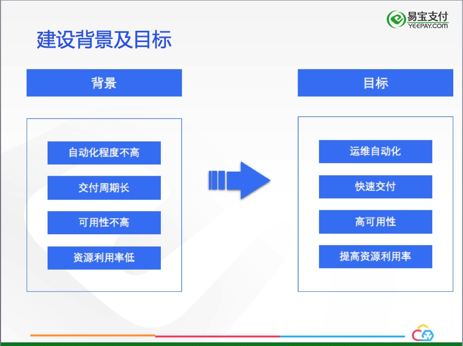
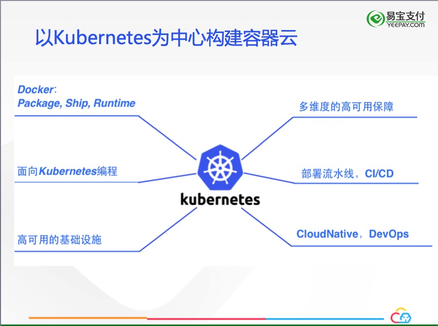
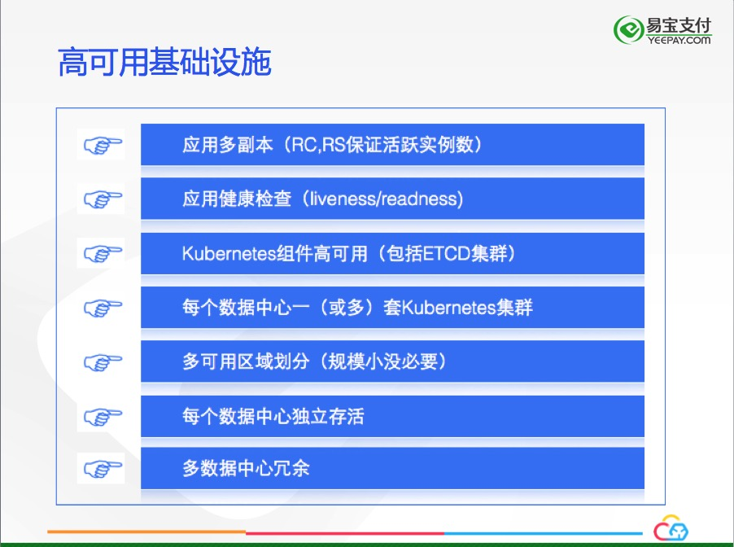
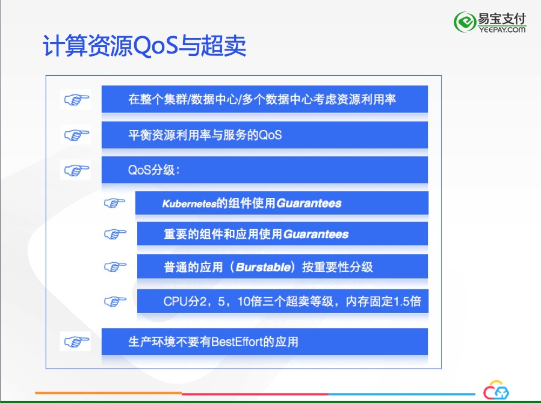
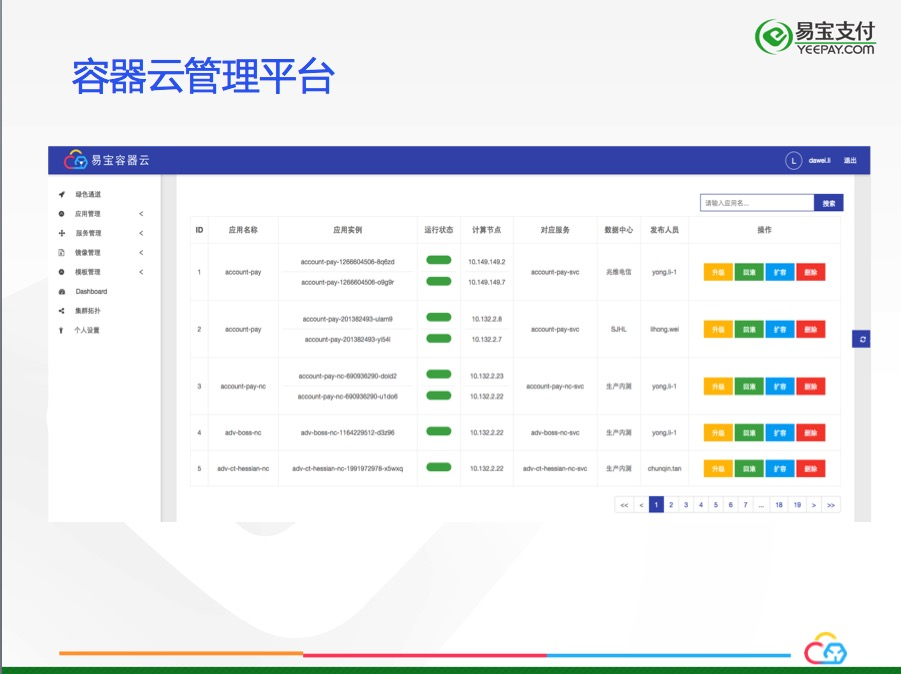
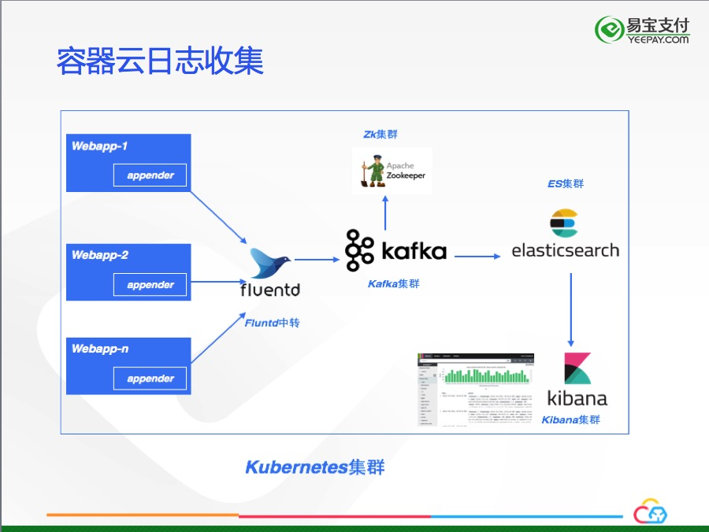
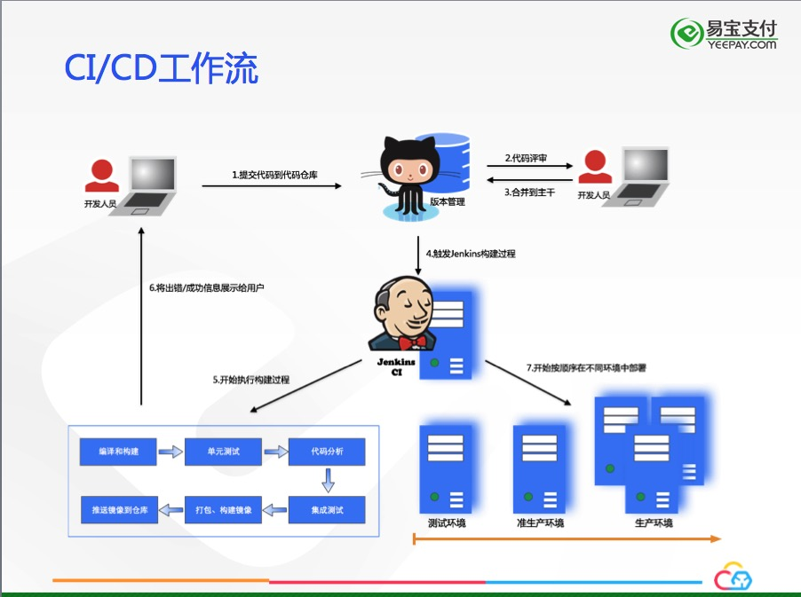
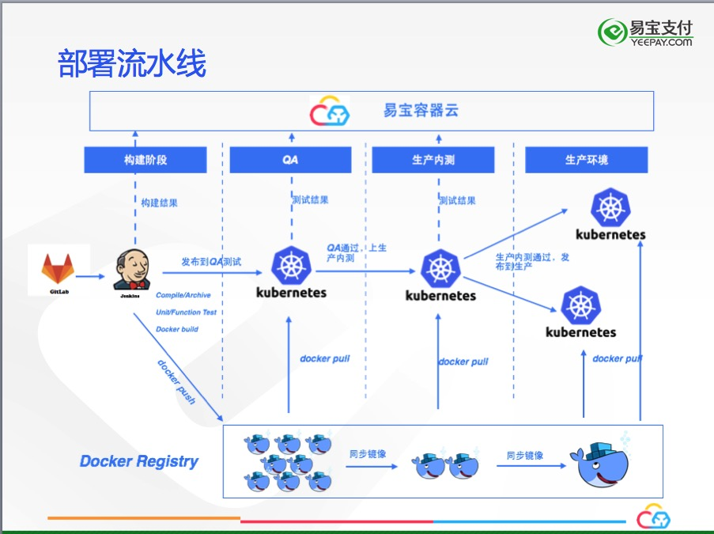

基于Kubernetes的私有容器云建设实践
====================================

非常感谢颖杰提供了这么好的分享平台。今天，很高兴为大家介绍易宝支付基于*Kubernetes*构建私有容器云的实践。

今天的分享分为如下几个部分：

### 建设背景及目标
--------------------

在*Docker*技术流行开来之前，保证软件交付的质量和速度对于大多数企业来说都是困难的。业务的复杂性造成了应用的复杂性，面对成千上万的不同应用，运维部门需要时刻应对来自不同应用、不同环境的挑战。特别是在自动化运维程度不高的企业，“人肉运维”成了解决问题的常用手段，人肉运维造成了软件交付的周期漫长，人为事故风险很高。 2013年，*Docker*横空出世，它的"Build once, Run anywhere"的特性让软件交付焕然一新。我们是在认真调研了Docker技术后，决定构建自己的私有容器云，背景和目标如下：

实现运维自动化是我们立项之初最主要的目标，在解决运维自动化之后，后面的目标才有实现的基础。这个因素直接制约了我们的技术选型。

### 技术选型
--------------------

我们是在2015年6月份开始调研技术，2015年8月份开始容器云立项，首先要面对的问题，就是如何进行容器编排引擎的选型，可供选择的有Swarm，Mesos，Kubernetes，甚至自主研发集群编排，我们认真调研了每一种方案：

Swarm当时是0.4版本，功能还比较简单，技术栈比较简单，小团队即可驾驭，但是考虑到它不是稳定版，虽然它发展很快，但是没有解决我们现有的问题，所以Swarm不被优先考虑。

Mesos当时是0.23版本，它能够胜任大规模场景的容器编排，偏重于资源抽象，与我们大多数是Java Web的应用的场景不符，另外，Mesos技术栈与我们现有技术栈差别太大，不得不放弃这个选择。

自主研发容器编排引擎我们也考虑过，但是经过认真的探讨，自研编排引擎对标三个开源的组件的功能，研发投入需要很多的成本，可能结果并不能达到预期，投入产出比低。另外，容器云作为底层的基础设施，选择更要慎重，如果项目失败，可能会离主流的容器技术越来越远，机会成本太高，所以自研的路线也被否定。

Kubernetes是我们的最终选择，它当时是1.0.2版本，已经是"Production Ready"，我们选择Kubernetes的最主要的原因是它理念的先进，而且非常适合我们公司的主流应用，Java Web应用都是Long time running的任务，Kubernetes的"Replication controller"对它支持非常好。Kubernetes以应用为中心的理念和社区的活跃度更是坚定了我们的选择，历时三个月的技术选型终于落下帷幕，我们决定使用Kubernetes构建我们的私有容器云平台。

### 理论基础和原则
--------------------

在我们决定使用Kubernetes的作为容器编排引擎后，关于选型的争论持续了很长的一段时间，当时国内Kubernetes的使用者还比较少，很难找到成功的案例。我们需要深入的研究Docker, Kubernetes相关的容器技术，确保我们的决策是正确的，这对我们构建容器云至关重要。经过很多的调研和讨论，我们发现容器云的是有一套完成的理论基础支撑的，这些理论又引申出我们构建容器云的原则：

**不可变基础设施**，是利用Docker镜像的不可变性，以更加便捷的方式维护基础设施：当基础设施损坏或者变更时，以直接替换的方式达到目的，而不是通过修缮损坏的基础设施，这么做需要替换的成本足够低，Docker显然做到了这一点；对于已经运行的Docker容器，如果它出现异常，不再是传统ssh上去调试的方式，应该是杀掉这个容器，重新启动一个新的容器；替换操作具有快速和可重复的特性，任何操作都可以随时回滚，安全可靠；对于生产环境的运维，不可变基础设施的理念尤为重要，很多事故都是在生产环境中直接修改造成的。

**基础设施即代码**，管理基础设施像管理代码一样，每个基础设施都是“可描述”的，例如Kubernetes中的Node概念，他们也应该作为“代码”的一部分以代码的方式进行管理。

**可编程的基础设施**，基础设施不仅仅是提供计算、存储、网络资源，还要为上层应用提供可编程的接口，让上层应用可以更加灵活的使用基础设施，容器云从立项之初就考虑到了这一点，容器云平台有一套完整的对外Restful API，可供上层应用，甚至外部应用调用。

保证构建容器云的过程能够正确的进行，还需要一些原则，”Build once，run anywhere"，一个Docker镜像要贯穿QA到生产环境的每个环节，不允许QA和生产的镜像出现不一致的情况。"ALL in one"，对于Java web应用，由于历史原因，可能多个web app运行在同一个tomcat中，要求每个docker镜像中只运行一个web app。

以应用为中心，是我们原则的中心，也是容器云构建最主要的目标，这个原则确保我们关注的重点是应用，而不是进行计算资源的抽象和资源的调度，我们的理想目标是，在“优雅地“管理应用的整个生命周期同时，顺便做好资源抽象，提高资源的利用率。

分层治理要求，基础设施的治理由容器云完成，上层应用的治理由应用治理层负责，从saas，到paas，再到caas，分层治理，各层通过接口相互调用，层与层之间互不侵入。

### 以Kubernetes为中心构建容器云
--------------------

容器云的目标决定了我们面对的是应用的管理，即应用对应的docker容器的管理，这就要求我们要以Kubernetes为中心构建容器云，而不是以docker为中心。Docker只作为应用打包、传递、运行时的工具，所有的API都要面向Kubernetes进行设计。

容器云要实现高可用的基础设施，能够支持多个数据中心。对于应用，要有多维度的高可用保证，要贯通部署流水线，通过CI/CD实现快速交付，另外，容器云的建设肩负的额外目标是要为未来2~4年的技术发展做铺垫，对于应用的CloudNative改造和整个技术团队的DevOps实践奠定基础。

容器云第一步是实现应用的全生命周期管理，让应用实现秒级的上线、回滚、升级、扩容/缩容、下线。由于历史的原因，有些应用的配置和环境耦合在一起，有的应用是对于外部依赖是硬编码（例如写死了服务方的IP地址）等，这些应用在迁移至容器云之前需要进行改造。

容器云要实现多数据中心多活，以保证数据中心级的高可用性。对于弹性扩容，我们的计划是先实现手动扩容，在实现自动扩容，对于自动扩容，先实现基于CPU/Memory的自动扩容，再实现基于Custom Metrics的自动扩容。与大多数构建容器云的方式不同，我们首先解决生产环境的运维自动化的问题，其次再解决容器的构建问题（即CI/CD)。我们的网络选型是flannel，万兆网络，flannel虽说有性能损失，远能满足我们的实际需要。存储我们使用Ceph的RBD方式，使用一年多来，RBD的方案非常稳定。Ceph FS的方式我们也有尝试，但是由于团队精力有限和可能的风险，一直没有正式使用。

### 高可用基础设施
----------------------

容器云要实现高可用的基础设施，多维度保证应用/服务的高可用性：

在应用层面，每个应用有至少3个副本，通过Kubernetes ReplicationController/ReplicaSets来保证。强制每个应用暴露健康检查接口，通过（liveness和readness）保证应用异常后能够被及时的发现，从而用新的实例代替。

Kubernetes的组件也要实现高可用，特别是ETCD集群的高可用，定期备份ETCD的数据是个好习惯。

为了保证数据中心级别的高可用，我们在每个数据中心部署了一套Kubernetes集群，每个数据中心能够独立存活，多个数据中心互相灾备。

### 计算资源QoS与超卖
----------------------

由于资源限制，技术人员过于看中单机的资源利用率。Docker(Cgroup, Namespace)提供的资源共享与隔离的机制，让我们对资源利用率有了新的认识，特别是使用容器编排引擎后，我们对资源的理解应该在集群维度进行考量，而不是在考虑单机的利用率。同样，在整个数据中心，甚至多个数据中心进行资源利用率的综合考量也是非常必要的。

在提高资源利用率、降低成本的同时，需要在服务的QoS与优化资源利用率中有个平衡。我们的原则是在保证服务质量的同时，尽量提高资源的利用率。

根据Kubernetes的资源模型，在Pod level的QoS分为三个等级：**Guarantee**, **Burstable**, **BestEffort**，我们也是依照这三个级别对应我们应用的优先级来制定资源超卖的标准。

我们对应用(**Burstable**)设置的超卖标准：

1. Kubernetes自带的组件使用**Guarantee**

2. 重要的组件和应用，比如Zookeeper，Redis，用户服务等使用**Guarantee**

3. 普通的应用按照重要性分级，按重要程度CPU分为2，5，10三个超卖标准，10倍超卖适合boss后台类的应用，大多数适合访问量不高。内存使用固定的1.5倍超卖标准。

有一点需要特别注意，在生产环境中，不要使用**BestEffort**的方式，它会引发不确定的行为。

### 容器云管理平台
----------------------

随着越来越多的应用迁移到容器云中，需要建立一个可视化的管理系统，我们使用Kubernetes原生API搭建一套Web管理系统，通过对Namespace/ResourceQuota/Deployment/Service/Endpoint等API的调用实现资源配额的划分和应用生命周期的管理。

容器云平台在易用性方面最大的挑战是Troubleshooting的环节，容器云最终是要交付开发人员使用，他们对Kubernetes并不了解，这让Troublesh的环境富有挑战，我们现在只是想通过websocket将kubectl exec的console展示给用户，没有更好的方案，如果各位有更好的方案，请不吝赐教。

容器云未来要实现整个数据中心的可视化，让运维对所有的数据中心的运行情况一目了然，当然，实现这一目标有相当的难度。

容器云的监控采用Heapster的方案，正在向Prometheus方式转变。

日志收集方式是EFK的组合

容器云管理系统的基本功能如下图所示：

日志收集方案如下图所示：

我们为Java应用提供了一个公共日志组件——appender，它会将java的日志流式输出到fluend中转，输出到fluentd中转的原因是与现有的日志中心并行运行。其他的部分跟主流的EFK模式没有任何区别。使用DaemonSet运行fluentd和fluentd与应用以sidecar的方式进行日志采集也是比较好的选择。

在容器时代，CloudNative应用是必然的选择，构建云原生应用的原则请参考[12因子](https://12factor.net/zh_cn/)。

容器云管理系统也是个CloudNative应用，它也运行在Kubernetes中，与传统的上线工具不同的是，它能够进行自我生命周期管理。

Container based, Mircoservices Oriented是CloudNative倡导，只有应用向CloudNative转化，才能更好的发挥容器云的效力。

### CI/CD建设
------------------

按照我们预先的Roadmap，先解放生产环境的运维工作，再解决应用的构建、集成的问题。现在，容器云的管理系统基本上替代了日常维护的手工操作，频繁的手工触发构建成了容器云推进的瓶颈，所以，构建CI/CD平台变得非常紧迫。

经过前期调研，我们决定使用*Gitlab + Jenkins + Docker Registry*的技术栈构建CI/CD平台。为了统一技术标准和尽量减少构建过程中的不确定性，我们采用自动生成Dockerfile的方式，而不是让开发自己编写Dockerfile。我们采用稳定主干的方式，MR自动触发构建过程，经过单元测试，打包，编译和Docker构建，容器云的界面会实时显示构建的过程，在构建结束后，用户会受到构建的结果的邮件。最终，CI产出的Docker镜像会被推送至QA环境的Registry上。

对我们来说，CI/CD最重要和最难的环节是自动化测试，尤其是自动化集成测试，我们正在努力解决。

CI的过程我们还做了代码的依赖库检查，代码版本追踪和Docker镜像自描述等，让Docker镜像从产生开始，在测试，生产测试，生产等每个环节都是可追溯的。这样便于我们查找问题和对CI的过程进行持续的改进。

对常用技术栈和配置进行标准化也是CI建设的一个重要目标。保证CI产出的镜像的质量（类似次品率）是对CI系统考核的重要标准。

下图是我们CI/CD平台的工作流示意图：

下图展示了整个部署流水线，镜像从产生到生产部署的全过程，以及过程、结果的反馈：

### 遇到的问题和挑战
----------------------

到目前为止，回顾整个容器云的构建过程，来自技术上的挑战并不多，但是也踩了一些坑。

遇到过RBD盘被锁住，新产生的Pod无法挂载的情形，解决办法是将RBD盘手工解锁，新的Pod会自动挂载。

Kubernetes的一个Bug，Kubernetes的ReplicaSets名称是根据Deployment的PodTemplate的摘要产生，使用的Adler算法，Hash碰撞非常频繁，会在升级过程中，Deployment不能创建最新的ReplicaSets而造成升级失败。解决办法是讲adler算法换成fnv算法，来减少Hash碰撞的频率，这显然不是最终的解决方案，社区的讨论还一直持续，有兴趣的朋友可以参与讨论：https://github.com/kubernetes/community/pull/384, https://github.com/kubernetes/kubernetes/issues/29735。

由于一直没来得及迁移Harbor，我们一直直接使用Docker registry 2.1版本作为私有镜像仓库，使用Restful API时，`_catalog`默认返回字母序的前100个镜像，客户端需要处理分页的问题。

应用向容器云迁移是容器云建设过程中花费最多精力的地方，由于需要适应容器云背后的理念转变和对现有应用改造进行改造，迁移过程中受到了很多挑战，最大的挑战是Dubbo应用的迁移问题，由于flannel的overlay网络使容器化的Dubbo应用不能与overlay网络之外的应用联通，最后我们修改了网络策略，使得Dubbo的应用可以无缝的迁移到容器云中。

下一阶段容器云工作的重点，是推动应用向CloudNative方向改造，对应用进行微服务改造。

容器云面临的最大挑战来自于理念转变，容器技术改变了软件交付的生态，容器时代需要技术人员以新的理念构建应用，如何让技术人员顺利的完成理念的转变是每个容器云的建设者们需要认真考虑的问题。

今天的分享就到这里，谢谢大家！

